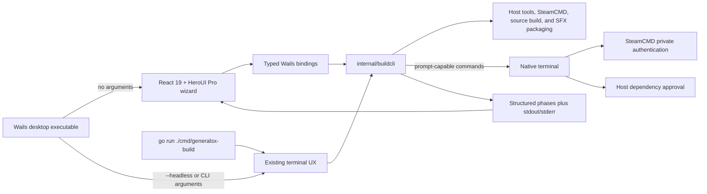

# PLAN-023 Automated Build Tool Desktop Experience

Date: 2026-08-05
Owner: GeneralsX
Status: Complete

## Goal

Make the Automated Build Tool approachable from a native desktop application on
the supported macOS, Linux, and Windows build hosts without replacing or
weakening the existing terminal workflow.

The packaged desktop executable opens a guided Wails interface when launched
without arguments. Passing `--headless`, `--help`, or any existing builder
argument runs the established terminal interface with the same output, prompts,
and exit status. The standalone Go command remains a dependency-light bootstrap
for machines that do not yet have a graphical runtime.

## Product Principles

- Explain each decision in build terms instead of exposing a wall of flags.
- Start with safe host-specific defaults and reveal advanced controls only when
  they are needed.
- Never collect, persist, or relay a Steam password or Steam Guard code.
- Keep retail game data local and clearly distinguish it from redistributable
  source and tool artifacts.
- Report the actual build phase and terminal output instead of simulating a
  successful build.
- Preserve cancellation, validation, diagnostics, and exact CLI behavior.
- Use one shared Go execution core so GUI and headless behavior cannot drift.

## Experience Flow

The main window is a focused four-step wizard followed by an execution view:

1. **Target** selects a build target supported by the current host.
2. **Game files** chooses a validated existing retail-data directory or
   SteamCMD acquisition using only the account name.
3. **Options** configures dependency installation, output paths, optional Online
   server support, and advanced reproducibility controls.
4. **Review** summarizes source, assets, target, output, host changes, and the
   personal-use retail-data boundary before the build can start.
5. **Build** shows the active phase, progress, live stdout/stderr, cancellation,
   and the final artifact path or actionable failure.

The layout uses a restrained dark desktop surface, semantic HeroUI colors,
generous spacing, one primary action per step, and a bounded scrolling log.
Controls remain keyboard accessible and keep visible labels; validation messages
appear next to the field that needs attention.

## Architecture

The implementation has two Go modules by design:

- the repository root owns `cmd/generalsx-build` and `internal/buildcli`; it
  remains a CGO-free bootstrap that does not require GTK, WebKit, or WebView2;
- `tools/generalsx-build-desktop` owns the Wails shell and web frontend, imports
  the shared builder core, and links the native graphical dependencies required
  by its host.

This separation matters on a fresh Linux machine: users can still run the Go
bootstrap before GTK and WebKit are installed. Release archives include the
native desktop app and a standalone headless companion.

## Backend Contract

The frontend sends one `BuildRequest` containing the same non-secret values as
the CLI flags. The Go bridge exposes:

- `GetDefaults` for resolved host paths and target defaults;
- `ChooseDirectory` for native directory selection;
- `ValidateBuild` for field-addressable errors and warnings;
- `StartBuild` for one cancellable build at a time;
- `CancelBuild` for cooperative context cancellation.

The shared builder also accepts an optional `InteractiveCommandRunner`. The
normal CLI leaves it unset and continues to attach prompt-capable commands to
its own terminal. The Wails backend supplies a native-terminal runner for
SteamCMD authentication and explicit dependency installers that can request
host approval, waits for each exit status, and then resumes the same in-process
build. Executable and argument fields stay separate across this boundary; user
values are not interpolated into a shell command.

Long-running work publishes two event streams:

- `builder:progress` carries job ID, stable phase, status, message, percentage,
  and final exit code;
- `builder:log` carries job ID, stdout/stderr stream, and plain text.

Stable phases are `preflight`, `source`, `toolchain`, `assets`,
`online-server`, `build`, and `complete`. The UI treats percentages as
indeterminate when the underlying external command has no measurable total.

## Credential and Data Boundary

SteamCMD continues to own all password and Steam Guard interaction through a
terminal stdin. The GUI accepts an account name only and never adds password,
token, or challenge fields. When incomplete assets require a download, the
desktop backend opens a native terminal for SteamCMD, waits while the user
authenticates there, and resumes the GUI build after SteamCMD exits. If no
supported terminal can be opened, the build stops with an actionable error and
leaves the existing asset tree untouched; it never falls back to a GUI password
prompt.

Homebrew bootstrap, Rosetta installation, and Linux `sudo` package-manager
operations use the same terminal handoff for administrator interaction. They
are purpose-tagged separately from Steam authentication, and no generic build
command is moved out of the structured GUI log.

The application does not upload retail data, include it in logs, or include it
in GitHub releases. Output paths are rejected when they overlap unsafe retail
staging locations. Build logs are held in the current application session and
can be copied deliberately by the user.

## Platform and Release Model

| Host | Desktop artifact | Headless companion | Native GUI requirement |
|---|---|---|---|
| macOS/ARM64 | `GeneralsX Automated Build Tool.app` | `generalsx-build` | macOS WebKit |
| Linux/AMD64 | `generalsx-build-desktop` | `generalsx-build` | GTK 3 and WebKitGTK 4.1 |
| Windows/AMD64 | `generalsx-build-desktop.exe` | `generalsx-build.exe` | Embedded WebView2 bootstrap/runtime |

Exact `vX.Y.Z` tags build on native GitHub-hosted runners. CI verifies the root
module, frontend types/tests/build, nested desktop module, headless smoke mode,
desktop GUI startup, provenance, and checksums before publishing three platform
archives. Wails v2 disables Go VCS stamping for its desktop binary, so CI embeds
and verifies the exact product version and source commit with linker values; the
standalone headless companion retains normal Go VCS metadata. The HeroUI Pro
package is installed with the repository's licensed CI secret; workflows never
print or persist that credential, and untrusted fork pull requests do not
receive it.

Initial desktop artifacts are unsigned development builds unless a platform
signing identity is configured. macOS distribution therefore does not claim
notarization, and Windows distribution does not claim Authenticode signing.

## Accessibility and Failure States

- Every form control has a visible label and contextual description.
- Target choices unsupported by the current host are absent rather than merely
  failing after submission.
- Keyboard focus follows the wizard and is not trapped in the log.
- Errors preserve their original builder message and remain copyable.
- Missing production Wails bindings fail closed; simulated events are available
  only through the explicit Vite preview mode.
- Cancellation changes the final status to cancelled only after the Go context
  has propagated to the active operation.
- Closing the window during a build requests cancellation before shutdown.

## Acceptance Criteria

- A no-argument desktop launch opens the wizard on macOS, Linux, and Windows.
- `--headless` runs the existing terminal UX, and all prior flags remain valid.
- GUI and CLI call the same validated Go build pipeline.
- No UI or backend API accepts Steam secrets.
- GUI Steam acquisition opens SteamCMD in a native terminal and returns its
  success, failure, or cancellation to the active build.
- Prompt-capable host dependency installation opens in a native terminal and
  returns to the same build without relying on detached GUI standard input.
- Defaults, validation, directory selection, progress, logs, cancellation, and
  success/failure states have automated coverage.
- Frontend type checks, unit tests, production build, and responsive visual QA
  pass.
- Root and nested Go tests, race tests, vet, module verification, and a native
  Wails build pass.
- Tag releases contain only the build tools, licenses, and checksums—never game
  assets or generated SFX payloads.

## Deferred Work

- A native pseudoterminal flow for Steam Guard inside the desktop app.
- Signed and notarized macOS, Authenticode-signed Windows, and Linux package
  manager distributions.
- Persisted build profiles and build history beyond the current session.
- Remote build agents or cross-host orchestration.
